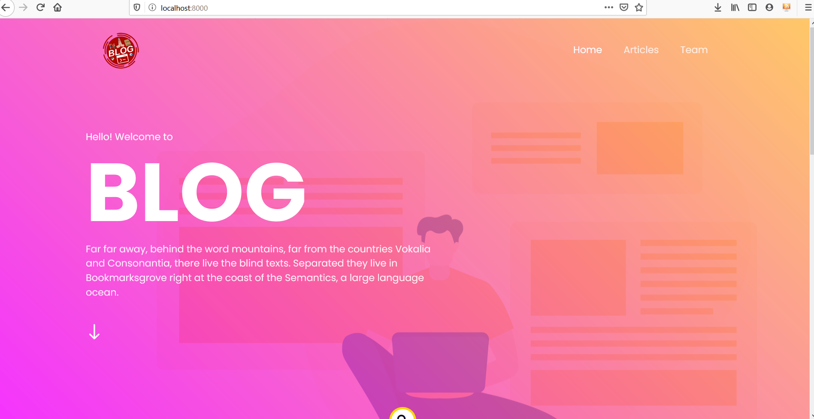
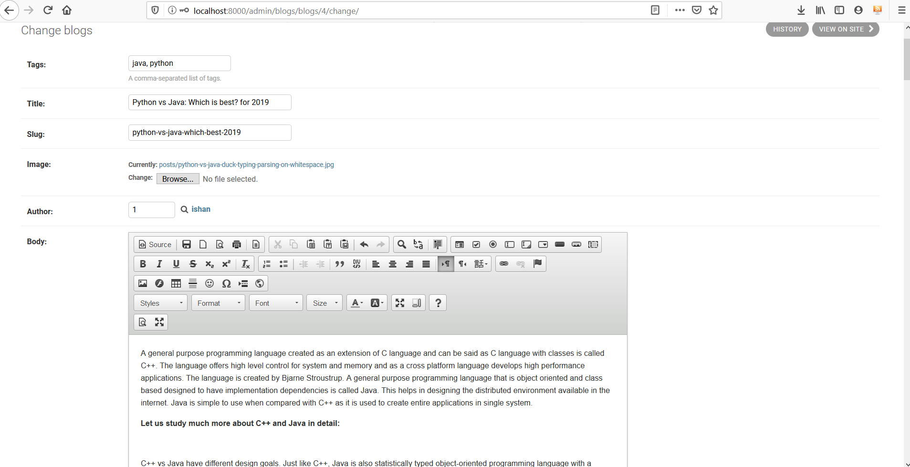

# Blog

Dynamic personal blogging site using django
<a href="https://udaan-blog.herokuapp.com/">CLICK HERE</a> to see the site

# Tools/Languages Used
  
  * Django framework(Python based) is used as a backend
  * HTML/CSS, JavaScript
  
# Images

Events become more interesting if their after-reports are superb!!
A blogsite for a literature society as active as Udaan, becomes a prime necessity as the activities needs to be showcased to the outer world, so that next time whenever an event happen, each and every newbie out there has its info and can be a part of it....

We provide you a one-stop platform to addon the event-reports and your views over any of your random but fav topic, who knows.. people love your random thoughts...!!

This is a project specific for a blogsite, with a basic design and numerous functionality, **open to contribution by IIIT Kalyani students**, to share a common path to make it a blogsite for UDAAN...

# Functionality covered in this blogsites currently are:

  1. Dynamic posts
  2. WYSIWYG editor for writing posts(ckeditor)
  3. Published/draft functionality
  4. Tags system
  5. Search system
  6. Comments system
  7. Similar posts system

# Scope for enhancements are:
  1. Authentication System to give some special access to IIIT Kalyani students
  2. User Profile
  3. Like Button
  4. Share Button
  5. Post option for all IIIT Kalyani students
  6. And many more..., **create issue of whatever you want too add in this blog**😇😇😇😇😇.

# Getting Started

   1.Fork it!

   2.Clone the forked repository to local system.
   
   3.Read issues and solve it, **or add your own issues** 😊

   4.Commit your changes: git commit -m 'Add some feature'.

   5.Push to the <a href="">feature</a> branch

   7.Submit a pull request 😄

Note- **Official publication and rights possession of this blogsite as being that of Udaan is a wholesole subject to decision of Udaan and noobDEV... contributors will be provided credit once their contribution is merged with the main branch.**
  

  
  

  

